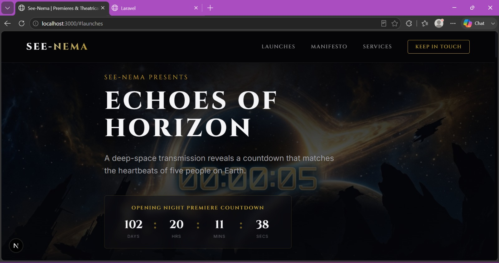
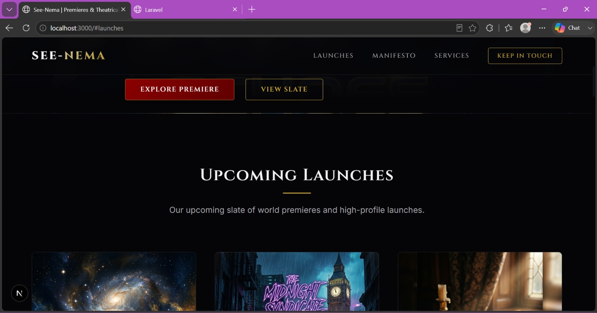
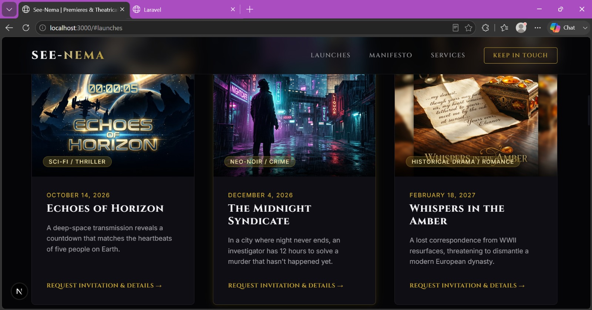
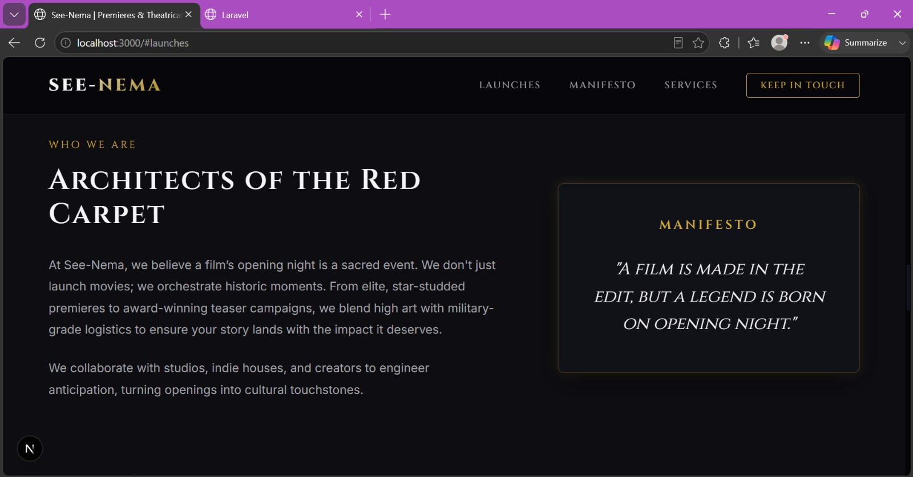
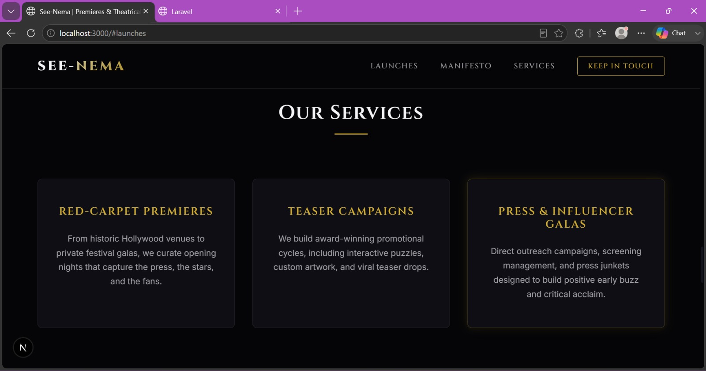
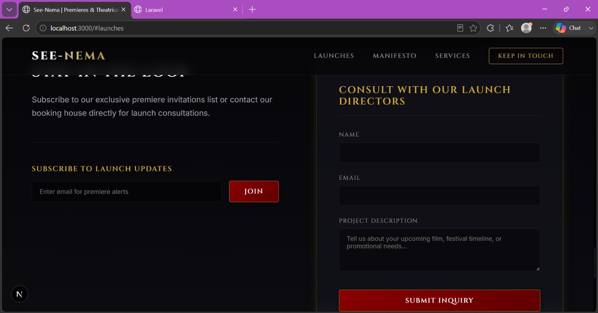

# See-Nema Launch Co. 🎬

See-Nema is a fictional movie-launch company—a premium, studio-adjacent house that designs teaser campaigns, coordinates red-carpet premieres, and orchestrates global theatrical openings. This repository holds the full-stack codebase, consisting of a **Next.js frontend** and a **Laravel API backend**.

---

## 🎨 Visual Preview

Here is a glimpse of the cinematic art direction, typography, and layout of our film slate:

### Signature Hero & Countdown Experience
The soonest-releasing film headlines the hero — title, logline, background art, and the live countdown are all pulled dynamically from the Laravel API, not hard-coded.



### Upcoming Launches
A browsable, dynamically-served slate of every film currently on the books, complete with poster art, release date, and logline.




### Film Detail Page
Each film gets its own dedicated page — synopsis, cast, director, premiere date, a trailer embed, and a VIP invite request form — all driven by the same API, addressed by slug.


### The Manifesto — Who We Are


### Our Services


### Stay in the Loop
The newsletter and contact forms both persist through the Laravel API, with real inline validation and success/error states.



---

## 🛠️ Stack Choices & Trade-offs

### Frontend: Next.js (App Router)
* **Rationale**: Next.js App Router provides lightning-fast page transitions, dynamic layout headers, and robust component architecture.
* **Styling**: In order to achieve a custom-tailored, premium, cinematic feel (deep glassmorphism, elegant gold glows, customized text transitions, and responsive grids), we wrote bespoke **Vanilla CSS** and component-scoped styling instead of using preconfigured utility frameworks. This allowed us absolute artistic control over the typography (`Cinzel` for headings, `Inter` for body) and spacing.
* **Trade-offs**: Instead of setting up global state machines, we relied on component state (`useState`, `useEffect`) to manage interactions (like countdown timers, modal screens, and contact states) which keeps the codebase clean, lean, and performant.

### Backend: Laravel API (PHP 8.2)
* **Rationale**: Laravel offers an elegant Eloquent ORM, built-in validation helpers, and rapid api scaffolding.
* **Database**: We utilized **SQLite** as the backend database. This makes the local setup a true "zero-configuration" experience—the database is fully self-contained as a file inside the repository.
* **CORS Support**: Published and configured CORS policies to allow cross-origin requests from the Next.js local server (port 3000).

### Tooling Trade-offs
* **Webpack over Turbopack**: `next dev` defaults to Turbopack in this Next.js version, but we hit a reproducible Turbopack dev-server crash specific to the dynamic `films/[slug]` route (its internal worker pool would exhaust and never recover). `package.json`'s `dev` script explicitly runs `next dev --webpack` instead — Webpack is Next.js's original, fully mature compiler, and it has no such issue. This only affects local development speed, not the production build or the deployed site.
* **`127.0.0.1` over `localhost`**: `NEXT_PUBLIC_API_URL` is set to `http://127.0.0.1:8000` rather than `http://localhost:8000`. Server-rendered pages fetch data from Node's server-side runtime, which resolves `localhost` to the IPv6 loopback address first — but the Laravel dev server only listens on IPv4. Using the literal IP sidesteps that mismatch entirely.

---

## 🚀 Setup & Run Guide

Follow these steps to spin up the API backend and frontend client on your local machine.
You'll need **two terminals running side by side** — one for the API, one for the frontend.

### Step 1: Run the Laravel API Backend

1. Make sure you have **PHP (>= 8.2)** installed on your machine.

   > **Windows / XAMPP users:** if `php` isn't recognized as a command, PHP isn't on your
   > system `PATH`. Either add `C:\xampp\php` to your `PATH`, or call the full path
   > directly in every command below, e.g. `C:\xampp\php\php.exe artisan serve`.

2. Navigate to the API folder:
   ```bash
   cd api
   ```
3. Install PHP dependencies (skip if `vendor/` already exists):
   ```bash
   composer install
   ```
4. Copy environment variables:
   ```bash
   copy .env.example .env
   ```
5. Generate the application key:
   ```bash
   php artisan key:generate
   ```
6. Run the migrations and seed the fictional films database (SQLite — no separate database server needed, it's a single file at `database/database.sqlite`):
   ```bash
   php artisan migrate --seed
   ```
7. Start the local development server:
   ```bash
   php artisan serve
   ```
   *The API will be available at: **`http://127.0.0.1:8000`***

   Leave this terminal running. You can confirm it's working by opening
   `http://127.0.0.1:8000/api/films` directly in a browser — you should see raw
   JSON for the four seeded films.

   **(Optional)** Run the automated test suite to confirm the API itself is correct:
   ```bash
   php artisan test
   ```

---

### Step 2: Run the Next.js Frontend

1. Make sure you have **Node.js (>= 18)** installed.
2. Navigate to the frontend folder (in a **new terminal**, leaving the API running):
   ```bash
   cd frontend
   ```
3. Create your local environment file:
   ```bash
   copy .env.local.example .env.local
   ```
   This sets `NEXT_PUBLIC_API_URL=http://127.0.0.1:8000` — the address the frontend
   calls for film and contact data. We use `127.0.0.1` rather than `localhost` here
   deliberately: Node's server-side fetches resolve `localhost` to IPv6 (`::1`) first,
   which the PHP dev server doesn't listen on, causing failed requests specifically
   for server-rendered data. Explicit `127.0.0.1` sidesteps that.
4. Install dependencies:
   ```bash
   npm install
   ```
5. Start the frontend development server:
   ```bash
   npm run dev
   ```
   *The website will be available at: **`http://localhost:3000`***

   > **Note:** this project runs `next dev --webpack` rather than the newer
   > Turbopack default — we hit a Turbopack-specific dev-server crash on the
   > dynamic film-detail route during development and switched to the stable,
   > fully-supported Webpack compiler instead. See **Tooling Trade-offs** above.

### Verifying it worked

With both servers running, visit `http://localhost:3000`:
- The homepage hero, countdown, and film grid should populate with real data (not a loading spinner stuck forever, not an error card)
- Clicking a film card should open its detail page with synopsis, cast, and a trailer embed
- Submitting the newsletter box or the contact form at the bottom should show a real success message

If you instead see a "Connection to server could not be established" message, the
API server (Step 1) isn't running or isn't reachable at the URL in `.env.local`.

---

## 📂 Core Endpoints Provided

* **`GET /api/films`**: Returns the list of upcoming launches with title, genre, logline, release date, and poster URLs.
* **`GET /api/films/{slug}`**: Returns details of a specific film including full synopsis, cast, director, and trailer URLs.
* **`POST /api/contacts`**: Validates and persists contact/newsletter inquiries directly into the database. Handles error validations and returns success states.
